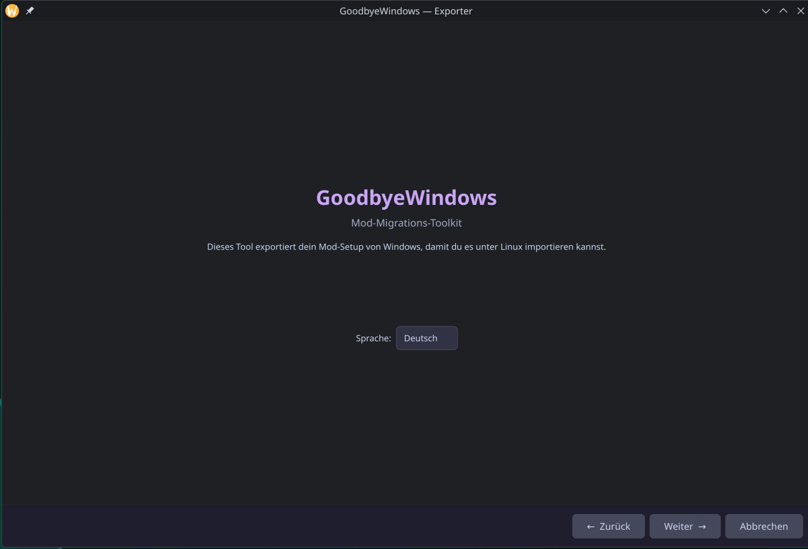
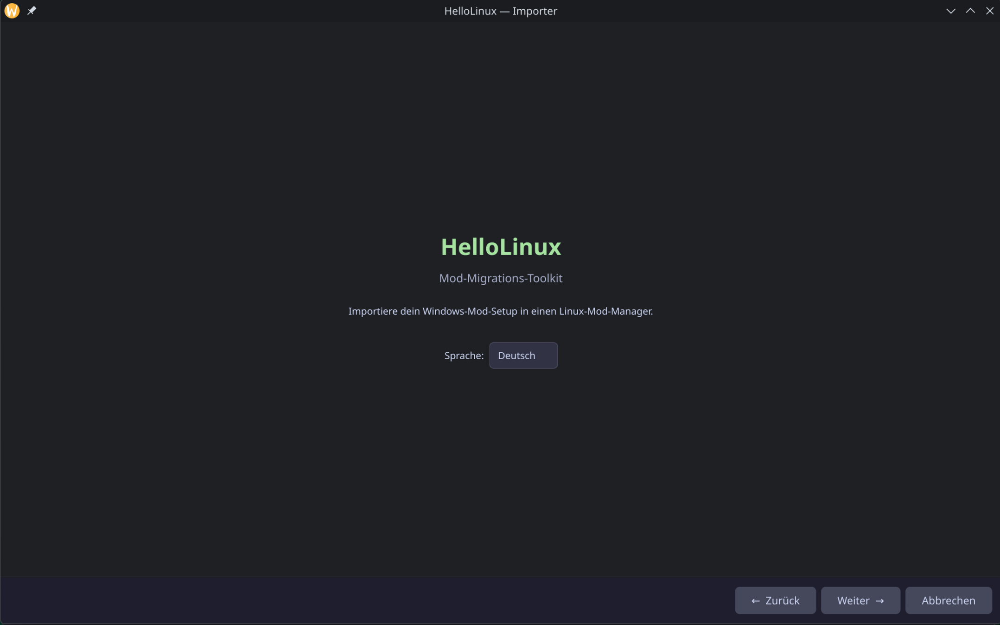

# GoodbyeWindows

**Mod Migration Toolkit — Move your mod setup from Windows to Linux.**

GoodbyeWindows helps you transfer your Mod Organizer 2 (MO2) or Vortex mod setup from Windows to Linux. It consists of two tools:

- **Exporter** (Windows) — Scans your MO2 instances and exports metadata + mod files
- **Importer** (Linux) — Imports into [Anvil Organizer](https://github.com/Marc1326/Anvil-Organizer) 

<p align="center">
  
  
</p>

## Features

- Full MO2 instance scanning (Registry, AppData, common paths)
- Vortex Mod Manager support (Experimental — not fully tested)
- Preserves load order, profiles, categories, and Nexus IDs
- Three export modes:
  - **Metadata only** (.gbw file) — small file, re-download mods on Linux
  - **Full export** — copies all mod files to USB/external drive
  - **Network transfer** — send directly over LAN with PIN authentication
- NTFS partition detection on Linux (dual-boot setups)
- Supports 19+ games (Skyrim, Fallout 4, Cyberpunk 2077, Starfield, Baldur's Gate 3, and more)
- Available in English and German

## Supported Games

| Game | Nexus Slug |
|------|-----------|
| Skyrim Special Edition | `skyrimspecialedition` |
| Skyrim | `skyrim` |
| Fallout 4 | `fallout4` |
| Fallout New Vegas | `newvegas` |
| Fallout 3 | `fallout3` |
| Oblivion | `oblivion` |
| Morrowind | `morrowind` |
| Starfield | `starfield` |
| Cyberpunk 2077 | `cyberpunk2077` |
| Baldur's Gate 3 | `baldursgate3` |
| The Witcher 3 | `witcher3` |
| Stardew Valley | `stardewvalley` |
| Dragon Age: The Veilguard | `dragonagetheveilguard` |
| Enderal | `enderal` |
| Enderal SE | `enderalspecialedition` |
| No Man's Sky | `nomanssky` |
| Monster Hunter World | `monsterhunterworld` |
| Elden Ring | `eldenring` |
| Mount & Blade II: Bannerlord | `mountandblade2bannerlord` |

## How It Works

### 1. Export on Windows

Run the GoodbyeWindows Exporter on your Windows PC. It scans for MO2 instances and creates a `.gbw` migration file containing:

- **manifest.json** — Tool version, source manager, game info
- **mods.json** — All mods with Nexus IDs, versions, categories
- **profiles.json** — Profile data with load orders and enabled states

For full exports, mod files are copied alongside the `.gbw` file.

### 2. Transfer

Choose one of three methods:
- **USB/External Drive** — Copy files manually
- **.gbw file** — Small metadata file via USB, cloud, or email
- **Network** — Direct LAN transfer with PIN authentication

### 3. Import on Linux

Run the GoodbyeWindows Importer on your Linux PC. It reads the migration data and imports into your chosen mod manager:

- **Anvil Organizer** — Creates instance with `.anvil.ini`, `modlist.txt` (v2 format), `active_mods.json`, and `meta.ini` per mod
- **Amethyst Mod Manager** — Creates profile with `modlist.txt`, `profile_state.json`, and Amethyst-compatible `meta.ini`

## .gbw Format

A `.gbw` file is a ZIP archive (v2):

```
GameName [MO2].gbw
├── manifest.json    ← game info, mod count, total size
├── mods.json        ← mod metadata (names, Nexus IDs, versions)
├── profiles.json    ← load orders and enabled states
└── mods/            ← (optional) actual mod files for full export
    ├── ModName1/
    ├── ModName2/
    └── ...
```

Metadata-only exports contain just the JSON files (~KB). Full exports pack all mod files into the same `.gbw` archive with selectable compression (None, Low, Strong).

## Network Transfer

The Exporter can run an HTTP server for direct LAN transfer:

1. Exporter starts server and shows IP + PIN
2. Importer connects using IP + PIN
3. Data transfers directly over your local network

API endpoints: `/api/ping`, `/api/auth`, `/api/instance`, `/api/mods`, `/api/gbw`, `/api/mod/<name>/files`

## Requirements

- **Python** 3.11+
- **PySide6** >= 6.6.0

## Building

### Windows Exporter (.exe)

```bash
pip install pyinstaller
pyinstaller build/build_exe.py
```

Creates a portable `.exe` — no installation needed.

### Linux Importer (.AppImage)

```bash
chmod +x build/build_appimage.sh
./build/build_appimage.sh
```

## Project Structure

```
GoodbyeWindows/
├── common/              ← Shared code
│   ├── mo2_reader.py    ← MO2 instance parser
│   ├── migration_format.py  ← .gbw format
│   ├── i18n.py          ← Internationalization (DE/EN)
│   ├── utils.py         ← File copy utilities
│   └── locales/         ← de.json, en.json
├── exporter/            ← Windows tool
│   ├── main.py          ← PySide6 QWizard GUI
│   ├── scanner.py       ← MO2 instance finder
│   ├── exporter.py      ← Export logic
│   └── server.py        ← HTTP server for LAN transfer
├── hellolinux/          ← Linux tool (HelloLinux Importer)
│   ├── main.py          ← PySide6 QWizard GUI
│   ├── detector.py      ← NTFS/USB detection
│   ├── client.py        ← HTTP client for LAN transfer
│   ├── importer_anvil.py    ← Anvil Organizer import
│   └── importer_amethyst.py ← Amethyst import
└── build/               ← Build scripts
    ├── build_exe.py     ← PyInstaller config
    └── build_appimage.sh
```

## License

GPL-3.0-or-later

## Related Projects

- [Anvil Organizer](https://github.com/Marc1326/Anvil-Organizer) — Native Linux Mod Manager
- [Amethyst Mod Manager](https://github.com/Jerem584/amethyst-mod-manager) — Linux Mod Manager
- [Mod Organizer 2](https://github.com/ModOrganizer2/modorganizer) — Windows Mod Manager
